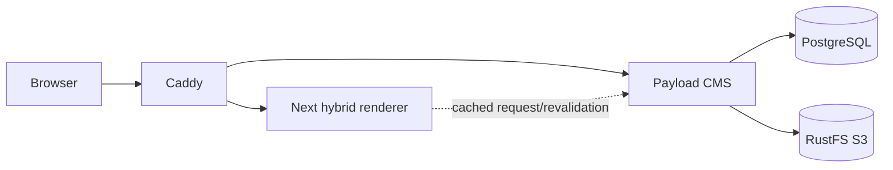

# System Architecture

## Status

Living specification for the desired system. The current repository is an initial scaffold and does not yet implement every target capability.

## Purpose

Payload is the source of truth for tenant configuration, page content, media, and publishing state. The web application is a thin renderer of code-defined components and does not own page-building rules.

## Runtime

| Area     | Target                                     | Initial scaffold                   |
| -------- | ------------------------------------------ | ---------------------------------- |
| Monorepo | npm workspaces and Turborepo               | Present                            |
| CMS      | Payload with PostgreSQL                    | Present                            |
| Media    | S3-compatible object storage               | RustFS and Payload adapter present |
| Web      | Next.js hybrid rendering/ISR and Mantine   | Initial implementation in progress |
| Routing  | Caddy path routing, future domain resolver | Caddy config present               |
| APIs     | Versioned service prefixes                 | Payload `/api` prefix              |

Tenant resolution is currently `/{tenant}/{slug}`. The resolver boundary is `getPage` in `apps/web/src/lib/cms.ts`; domain and subdomain mapping can be added there without changing component rendering.

## Component model

Blocks are declared in `apps/cms/src/blocks.ts` and therefore cannot be added or changed by editors. Editors configure field values and arrange the approved blocks in a page layout. The renderer maps block slugs to frontend components.

## Access Boundaries

This local demo deliberately does not model role-based CMS administration. Authenticated Payload users may administer shared tenant and media records; this is not a public write surface. Public visitors may read published pages and media, but cannot write through Payload access controls. Every runtime requires `PAYLOAD_SECRET` from the environment; local development and managed tests use the value supplied by `.env` or the caller.

## Gaps

Authenticated draft preview, domain mapping, CI, editor publishing E2E coverage, media hardening, seed export/import, Bruno coverage, backups, and recovery remain follow-up work.
